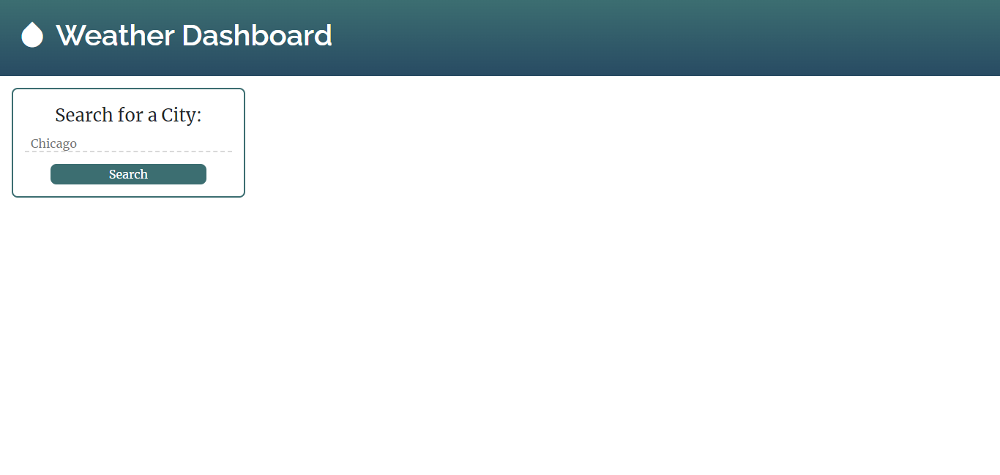
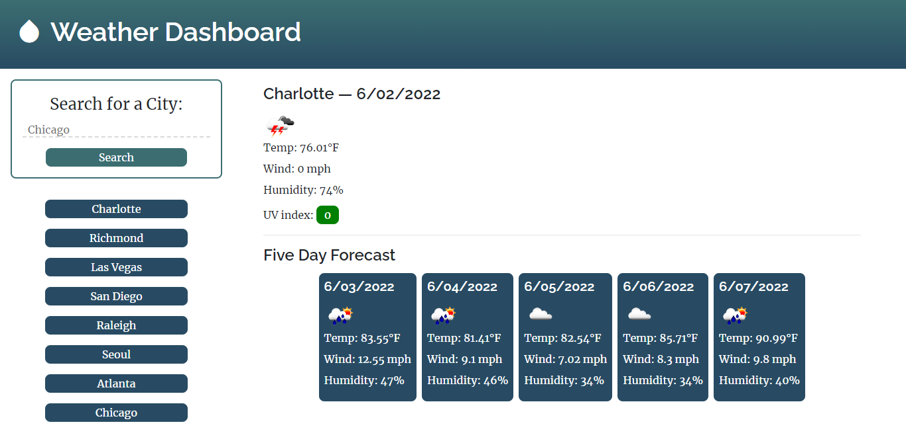

# Weather Dashboard

[Live Site](https://mycancel.github.io/weather-dashboard/)

## Table of Contents

- [Description](#description)
- [Visuals](#visuals)

## Description
When a user enters a city into the text input, the current weather and a five-day forecast is displayed. The city is saved in the user's search history as a button. If they press the button of a previous search, that city's weather data will be displayed again.

The Weather Dashboard uses data provided by the API [Open Weather](https://openweathermap.org/). The dates are created with [Moment.js](https://momentjs.com/) and the page is formatted with [Bootstrap](https://getbootstrap.com/).

## Visuals

